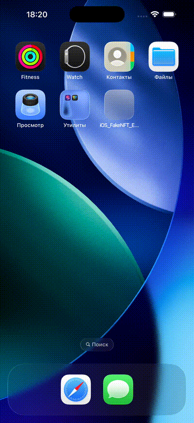

# ТЗ мобильного приложения FakeNFT

## Ссылки

[Дизайн Figma](https://www.figma.com/design/Uz5G39wRRCr2mRE4SbnNla/FakeNFT--YP-)

## Назначение и цели приложения

Приложение помогает пользователям просматривать и покупать NFT (Non-Fungible Token). Функционал покупки имитируется с помощью mock-сервера.

**Цели приложения:**

- Просмотр коллекций NFT;
- Просмотр и покупка NFT (имитируется);
- Просмотр рейтинга пользователей.

## Краткое описание приложения

- Приложение демонстрирует каталог NFT, структурированных в виде коллекций.
- Пользователь может просматривать информацию о каталоге коллекций, выбранной коллекции и отдельном NFT.
- Пользователь может добавлять понравившиеся NFT в избранное.
- Пользователь может управлять корзиной: добавлять/удалять товары и имитировать оплату.
- Пользователь может просматривать рейтинг пользователей и их профили.
- Пользователь имеет доступ к личному профилю с информацией о своих NFT и избранных коллекциях.

**Дополнительный (необязательный) функционал:**

- Локализация;
- Тёмная тема;
- Интеграция с Яндекс Метрикой;
- Экран авторизации;
- Экран онбординга;
- Алерт с предложением оценить приложение;
- Обработка сетевых ошибок;
- Кастомный экран загрузки (launch screen);
- Поиск по коллекциям/таблицам.

## Функциональные требования

### Каталог

#### Экран каталога

- Отображает таблицу (`List`) с коллекциями NFT.
- Для каждой коллекции указано:
  - Обложка;
  - Название;
  - Количество NFT.
- Кнопка сортировки: выбор критерия сортировки обновляет таблицу.
- Индикатор загрузки (`ProgressView`) отображается во время загрузки данных.
- Нажатие на ячейку открывает экран коллекции NFT.

#### Экран коллекции NFT

- Содержит:
  - Обложку и название коллекции;
  - Описание коллекции;
  - Имя автора (ссылка на сайт в `WKWebView` + `UIViewRepresentable`);
  - Коллекцию NFT (`LazyVGrid`).
- Каждая ячейка NFT включает:
  - Изображение;
  - Название;
  - Рейтинг;
  - Стоимость (в ETH);
  - Кнопку добавления в избранное (иконка сердца);
  - Кнопку добавления в корзину (отображает крестик при наличии NFT в корзине).
- Нажатие на ячейку открывает экран NFT (реализуется наставником).

### Корзина

#### Экран заказа

- Таблица (`List`) с NFT в корзине. Для каждого NFT указано:
  - Изображение;
  - Название;
  - Рейтинг;
  - Цена;
  - Кнопка удаления.
- При удалении отображается экран подтверждения:
  - Изображение NFT;
  - Текст подтверждения;
  - Кнопки «Удалить»/«Отмена».
- Кнопка сортировки в верхней части экрана.
- Панель внизу: общее количество NFT, сумма, кнопка оплаты.
- Индикатор загрузки отображается во время загрузки данных.
- Нажатие на кнопку оплаты открывает экран выбора валюты.

#### Экран выбора валюты

- Коллекция (`LazyVGrid`) с валютами. Для каждой валюты:
  - Логотип;
  - Полное и сокращённое название.
- Ссылка на пользовательское соглашение (открывается в веб-вью `WKWebView` + `UIViewRepresentable`; можно использовать ссылку https://yandex.ru/legal/practicum_termsofuse).
- Кнопка оплаты отправляет запрос:
  - При успехе — подтверждение;
  - При ошибке — всплывающее окно с кнопками «Повторить»/«Отмена».

### Профиль

#### Экран профиля

- Содержит:
  - Фото пользователя;
  - Имя и описание;
  - Сайт пользователя (открывается в веб-вью).
  - Таблицу (`UITableView`) с пунктами:
    - «Мои NFT» (переход к списку NFT);
    - «Избранные NFT» (переход к избранным);
- Кнопка редактирования профиля (изменение имени, описания, фото, сайта).

#### Экран «Мои NFT»

- Таблица (`List`) с NFT пользователя. Каждая ячейка содержит:
  - Иконку NFT;
  - Название;
  - Автора;
  - Цену (в ETH).
- Кнопка сортировки. При отсутствии NFT — сообщение.

#### Экран «Избранные NFT»

- Коллекция (`LazyVGrid`) с NFT из избранного. Каждая ячейка содержит:
  - Иконку;
  - Кнопку удаления из избранного (иконка сердца);
  - Название;
  - Рейтинг;
  - Цену (в ETH).
- При отсутствии избранных NFT — сообщение.

## Статистика

### Экран рейтинга

- Таблица (`List`) с пользователями. Для каждого указано:
  - Место в рейтинге;
  - Аватар;
  - Имя;
  - Количество NFT.
- Кнопка сортировки. Нажатие на ячейку открывает профиль пользователя.

#### Экран информации о пользователе

- Содержит:
  - Фото и имя;
  - Описание;
  - Кнопку перехода на сайт;
  - Возможность просмотра коллекций пользователя.

#### Экран коллекции пользователя

- Коллекция (`LazyVGrid`) с NFT. Каждая ячейка содержит:
  - Иконку;
  - Кнопку избранного;
  - Название;
  - Рейтинг;
  - Цену (в ETH);
  - Кнопку корзины.

## Сортировка данных

Доступна на экранах: «Каталог», «Корзина», «Мои NFT», «Статистика».
Настройки сохраняются локально (через `@AppStorage` или `UserDefaults`) и восстанавливаются после перезапуска.

**Значения по умолчанию:**

- Каталог — по количеству NFT;
- Корзина — по названию;
- Мои NFT — по рейтингу;
- Статистика — по рейтингу.

## Нефункциональные требования

### 1. Проект

- **Минимальная версия iOS:** 17.0 и выше;
- **Работоспособность:** проект компилируется без ошибок и запускается в симуляторе.

- **Фреймворк для верстки:** SwiftUI;
- **Архитектурный паттерн:** MVVM.

### 2. Архитектура

- Для `ViewModel` применено одно из решений (выбрать нужно что-то одно):
  - Использовать протокол `ObservableObject` и свойства типа `@Published`;
  - Использовать макрос `@Observable`.

#### 2.1 Общее

- Классы названы правильно. Компоненты архитектуры связаны корректно.
- Модификаторы используются корректно:  

```text
| Модификатор          | Назначение                                      |  
|----------------------|-------------------------------------------------|  
| `@State`             | Локальное состояние View                        |  
| `@Binding`           | Связь между View                                |  
| `@StateObject`       | Создание и хранение ViewModel                   |  
| `@ObservedObject`    | Подписка на существующую ViewModel              |  
| `@EnvironmentObject` | Общие данные в приложении                       |  
```

#### 2.2 Сеть

- Сервисы реализованы через `actor`;
- Данные помечены `Sendable` для потоко-безопасности;
- Запросы выполняются с использованием `async/await`.

### 3. Многопоточность

- **Запрещено:** использование GCD, `completion`-ов;
- **Обязательно:** обновление UI только из `@MainActor`;
- **Используется:** Swift Concurrency (`async/await`, `async let`, `withTaskGroup`).

## 📸 Preview

<details>
  <summary>Показать демонстрации</summary>
  <details>
    <summary>🛒 Корзина</summary>
    <table>
      <tr>
        <td></td>
        <td></td>
      </tr>
    </table>
    </details>
</details>
